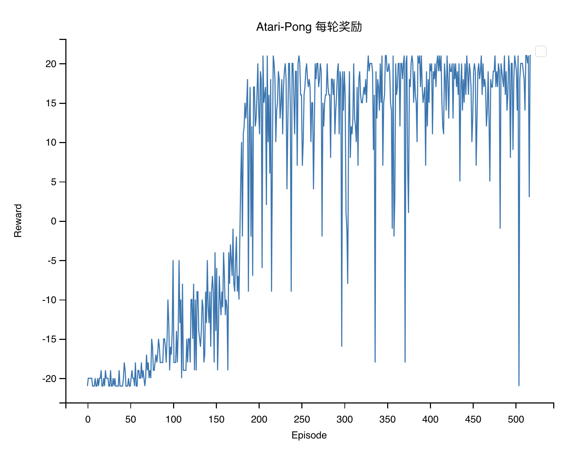

# DQN-Pong
深度学习-大作业～Inspired by https://github.com/KaleabTessera/DQN-Atari ～

Deep Q-network implementation for [Pong-v0](https://gym.openai.com/envs/Pong-v0/).  The implementation follows from the paper - [Playing Atari with Deep Reinforcement Learning](https://arxiv.org/abs/1312.5602) and [Human-level control through deep reinforcement
learning](https://web.stanford.edu/class/psych209/Readings/MnihEtAlHassibis15NatureControlDeepRL.pdf).
## 结果
### Nature 版本（视频）
[](http://www.youtube.com/watch?v=DcyMFIKsVNI "DQN For Atari Pong")
### 每轮奖励



## 大致框架
### DQN
- 输入层：
    Input是一个84×84×4的图像。使用了最近的4帧画面，每帧84x84像素。
- 卷积层：
    1st：32个8×8滤波器，步幅4。从输入图像中提取基础特征，如边缘和简单形状。
    2nd：64个4×4滤波器，步幅2。这一层提取更复杂的特征，步幅减小以获得更详细的特征图。
    3rd：64个3×3滤波器，步幅1。这一层进一步提取精细特征，步幅更小以保持特征的细节。
- 全连接层：
    第一层：256个ReLU的神经元。
- 输出层：
    Output是一个全连接的线性层，神经元的数量等于环境中的有效动作数。每个神经元对应一个动作的Q值。

#### Other Params
- Optimizer: RMSProp 
- Batch Size:  32
- E-greedy : 0.1

## How to 运行
### 新建Conda环境
```
conda create -n dqn_pong python=3.8
``` 

### 安装依赖
```
pip install -r requirements.txt
sudo apt-get install ffmpeg
```

### 从头开始训练
```
python train_atari.py
```
### 使用预先训练好的Agent
```
python train_atari.py --load-checkpoint-file results/checkpoint_dqn_nature.pth
```
## 观察结果
每50轮次记录一份视频。视频位于 `/video/` 。
